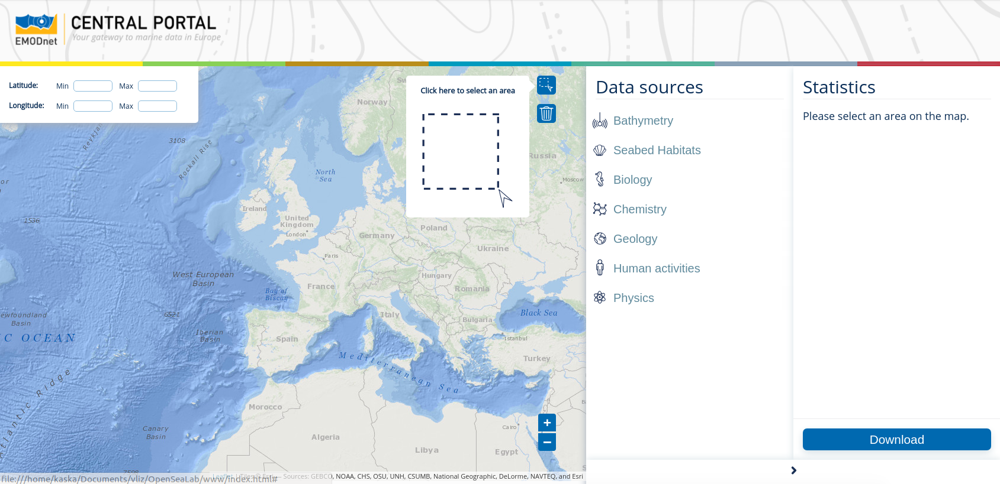

# Open Sea Lab

A web application to visualize marine data.

Our application, named Open Sea Lab, is a collaboration with open Summer of code, the Flanders Marine Institute, and the European Marine Observation and Data Networks group. 

Our application lets researchers, students, and policymakers explore marine data via an easy to use map interface. 

## Getting Started

Get the sever from vliz/OpenSeaLab/src/main/Main.java started and then open OpenSeaLab/src/main/Index.html in your browser to get started. 

### Prerequisites

Make sure you have the following programs.

* Jetty : jetty-9.3.2.v20150730
* Java : openjdk version "1.8.0_171" 

## Layers Currently Worked On

### 1) Bathymetry

WMS calls are made for data layers called "mean","mean_rainbowcolour","mean_multicolour","mean_atlas_land","source_references","contours", and "products". These will be displayed over the entire map.

Original portal:	http://portal.emodnet-bathymetry.eu/
					http://portal.emodnet-bathymetry.eu/services/

### 2) Seabed Habitats

WFS calls are made to the EMODnet severs to collect vector data for the types of sediment at the seafloor. This will display clipped polygons for the user selected rectangle on the map.

Original portal:	http://www.emodnet-seabedhabitats.eu

### 3) Geology

WFS calls are made to the EMODnet severs to collect vector data for the types of sediment at the seafloor, similar to seabed habitats. This will display clipped polygons for the user selected rectangle on the map.

Original portal:	http://www.emodnet-geology.eu

## Direct access to data
Here is a website where you can directly download data to use (without waiting)
http://www.emodnet.eu/geonetwork/emodnet/eng/catalog.search#/home
The dataset is also sorted  by topics: Oceans, Geo information, boundaries, biota, economy, planning cadastre, environment, etc

